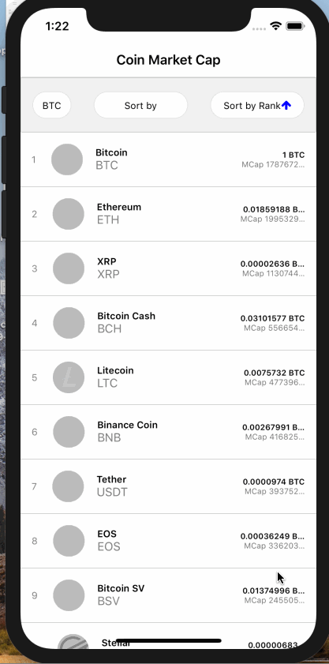

## ARCHITECTURE

Presentational components are separated from containers (aka "screens").

Presentational components are small components that are concerned with how things look. Containers usually define whole application screens and are concerned with how things work: they include presentational components and wire everything together.

State is managed using global Redux stores.

With Redux, state is shared using global stores, and changes are predictable: actions are applied by reducers to the state. While the pattern can be a bit much for small projects, the clear separation of responsibilities and predictability helps with bigger applications.

Application side-effects (API calls, etc.) are separated from UI and state manipulation using Redux Saga.

Using Redux Saga has two benefits: keeping application side-effects and related business logic out of UI components, as well as executing that logic in an asynchronous way without ending in callback hell.

Sagas are triggered by Redux actions and can also trigger Redux actions to alter state. By using JavaScript generators (yield), sagas are written in a synchronous-like manner while still executing asynchronously.

## FEATURES

Redux to help manage state

Styled compoenents to utilising tagged template literals

Flow for prop type checking mechnanism

Redux Saga to separate side-effects and logic from state and UI logic

React Navigation to handle routing and navigation in the app

reduxsauce to facilitate using Redux

jest in order to implement unit tests

## FOLDER STRUCTURE

App/Components: presentational components

App/Config: configuration of the application

App/Containers: container components, i.e. the application's screens

App/Sagas: redux sagas

App/Services: application services, e.g. API clients

App/Stores: redux actions, reducers and stores

App/Theme: base styles for the application

## DEMO

